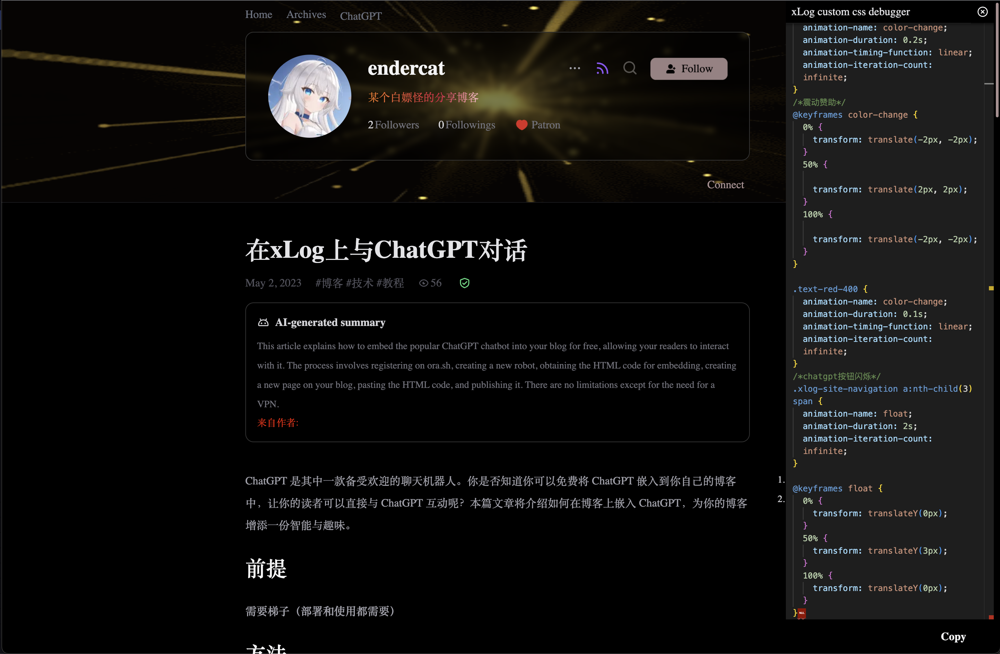

# xLog custom css debugger

A convenient chrome extension for debugging custom CSS in Xlog.



## Features
- Debug your xlog custom css in real time
- Enjoy a pleasant code editing experience with the Monaco Editor
- Explore other fantastic CSS styles on the fly
## Develop

```
$ yarn

$ yarn watch
```
## How to use

download latest releast dist.zip, from https://github.com/birdgg/xLog-custom-css-debugger/releases

unzip dist, open chrome://extensions/, enable developer mode, press load unpacked button and select dist folder

on your page, right click and select Toggle xLog css debugger to open editor

enjoy your debugging
## TODO
- [ ] Draggable and minimizable debug window
- [ ] modify style
- [ ] try unocss
- [ ] setup ci
- [ ] migrate from webpack to vite maybe(https://github.com/antfu/vitesse-webext)
- [ ] upload to chrome extension store
- [ ] firefox and edge version

## Contribute

fork from `dev` branch, and submit your pr to `dev`